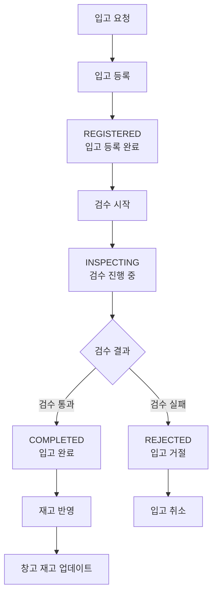

# 재고 관리 시스템 (Inventory Management System)

Spring Boot 기반의 재고 관리 시스템입니다.

처음부터 완벽한 프로그램을 만드려고 하지 않습니다. 변화하는 요구사항에 유연하게 대응하기 위해 점진적으로 기능을 추가하며 개발하고 있습니다.

## 무엇을 배우고 싶나요?

- 테스트 코드를 작성하며 비즈니스 요구가 변경되어도 장애 없이 기능을 추가하고, 변경하는 방법
- 대용량의 데이터를 효율적이며 안정적으로 처리하는 방법
- 차근차근 단계적으로 복잡한 시스템을 설계하고 구현하는 방법

## 무엇을 배웠나요?

- [Gradle에서 allProjects와 subProjects를 권장하지 않는 이유와 대체 방안](https://github.com/f-lab-edu/inventory-management-system/wiki/Gradle%EC%97%90%EC%84%9C-allProjects%EC%99%80-subProjects%EB%A5%BC-%EA%B6%8C%EC%9E%A5%ED%95%98%EC%A7%80-%EC%95%8A%EB%8A%94-%EC%9D%B4%EC%9C%A0%EC%99%80-%EB%8C%80%EC%B2%B4-%EB%B0%A9%EC%95%88)

## 주요 도메인

- **창고 (Warehouse)**: 물리적 창고 정보 관리
- **공급업체 (Supplier)**: 공급업체 정보 관리
- **상품 (Product)**: 상품 마스터 정보 관리
- **입고 (Inbound)**: 입고 프로세스 및 재고 관리

### 입고 프로세스



**입고 상태별 설명:**

- **REGISTERED**: 입고 예정 상품 등록 완료
- **INSPECTING**: 상품 검수 진행 중
- **COMPLETED**: 검수 완료 후 재고 반영됨
- **REJECTED**: 검수 실패로 입고 거절됨

## 🚀 실행 방법

### 1. 환경 설정

**1-1. .env 파일 생성**

```bash
# .env.example을 .env로 복사
cp .env.example .env
```

**1-2. .env 파일 수정**

```env
# MySQL Docker 컨테이너 설정
MYSQL_ROOT_PASSWORD=rootpassword
MYSQL_DATABASE_NAME=inventory
MYSQL_USERNAME=inventory_user
MYSQL_PASSWORD=inventory_password

# Spring Boot 애플리케이션 설정
SPRING_DATASOURCE_URL=jdbc:mysql://localhost:3306/inventory?useSSL=false&allowPublicKeyRetrieval=true&serverTimezone=UTC&createDatabaseIfNotExist=true
SPRING_DATASOURCE_USERNAME=inventory_user
SPRING_DATASOURCE_PASSWORD=inventory_password

# 서버 포트 설정
SERVER_PORT=10000
```

### 2. MySQL 실행

**2-1. MySQL Docker 컨테이너 실행**

```bash
docker-compose -f docker-compose.mysql.yml up -d
```

**2-2. MySQL 상태 확인**

```bash
docker ps
# inventory-mysql 컨테이너가 실행 중인지 확인
```

### 3. Spring Boot 애플리케이션 실행

**3-1. IntelliJ에서 실행**

- `ApiApplication.java` 파일을 열고 실행
- 또는 Run Configuration에서 `ApiApplication` 실행

**3-2. Gradle로 실행**

```bash
./gradlew :api:bootRun
```

### 4. 접속 확인

- **애플리케이션**: http://localhost:10000
- **MySQL**: localhost:3306
  - 사용자: inventory_user
  - 비밀번호: inventory_password
  - 데이터베이스: inventory

## 🛠️ 개발 환경 관리

### MySQL 컨테이너 관리

**컨테이너 중지**

```bash
docker-compose -f docker-compose.mysql.yml down
```

**컨테이너 재시작**

```bash
docker-compose -f docker-compose.mysql.yml restart
```

**데이터 완전 삭제 (주의!)**

```bash
docker-compose -f docker-compose.mysql.yml down -v
```

### 환경 변수 변경

**MySQL 비밀번호 변경**

1. `.env` 파일에서 `MYSQL_ROOT_PASSWORD` 수정
2. 컨테이너 재시작: `docker-compose -f docker-compose.mysql.yml down && docker-compose -f docker-compose.mysql.yml up -d`

**데이터베이스 연결 정보 변경**

1. `.env` 파일에서 `SPRING_DATASOURCE_*` 값 수정
2. Spring Boot 애플리케이션 재시작

## 📁 프로젝트 구조

```
inventory/
├── api/                          # Spring Boot 애플리케이션
│   ├── src/main/java/inventory/  # 소스 코드
│   └── src/main/resources/       # 설정 파일
├── docker/                       # Docker 설정
│   └── mysql/                    # MySQL 설정 파일
├── docker-compose.mysql.yml      # MySQL Docker Compose
├── .env                          # 환경 변수 (Git 제외)
├── .env.example                  # 환경 변수 예시
└── README.md                     # 프로젝트 문서
```

## 🔧 문제 해결

### MySQL 연결 실패

- MySQL 컨테이너가 실행 중인지 확인: `docker ps`
- 포트 충돌 확인: 3306 포트가 사용 중인지 확인
- 환경 변수 확인: `.env` 파일의 데이터베이스 설정 확인

### Spring Boot 실행 실패

- Java 버전 확인: JDK 21 필요
- 환경 변수 확인: `.env` 파일 존재 및 내용 확인
- MySQL 연결 확인: MySQL 컨테이너가 정상 실행 중인지 확인
