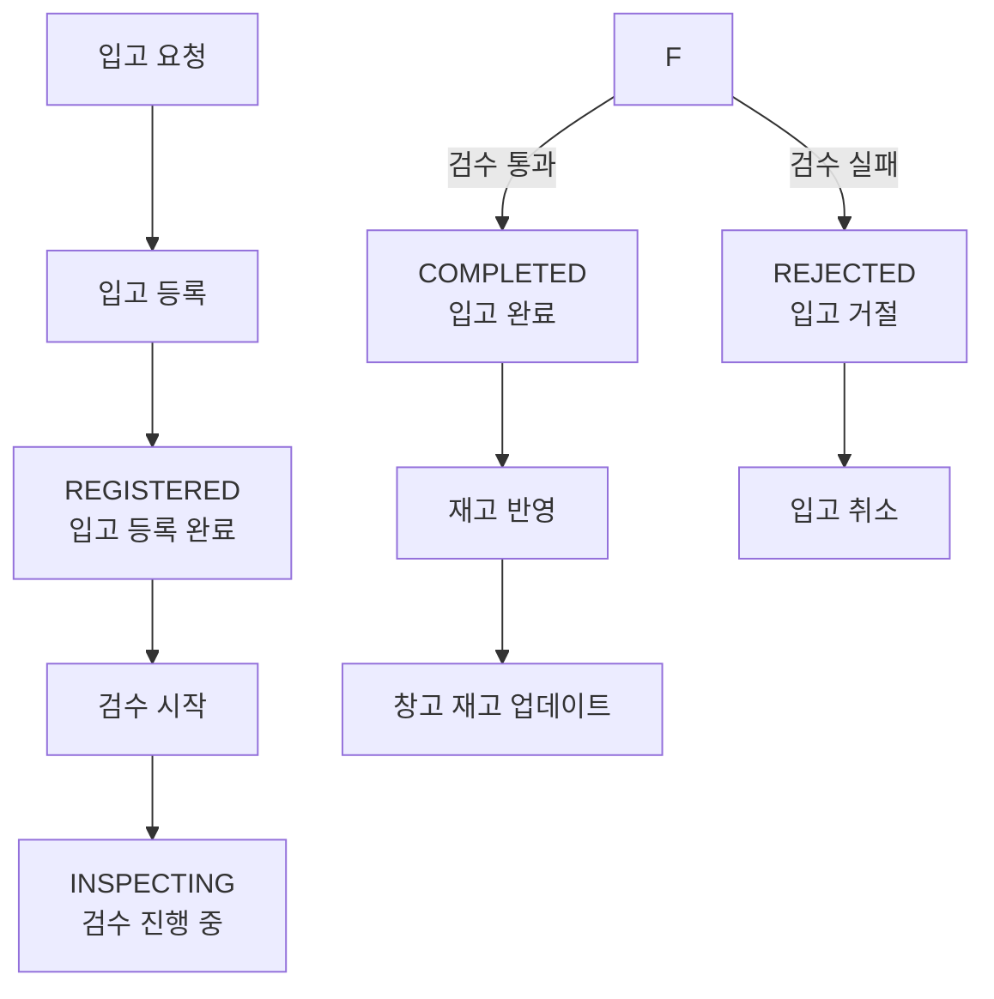

# 재고 관리 시스템 (Inventory Management System)

Spring Boot 기반의 재고 관리 시스템입니다.

처음부터 완벽한 프로그램을 만드려고 하지 않습니다. 변화하는 요구사항에 유연하게 대응하기 위해 점진적으로 기능을 추가하며 개발하고 있습니다.

## 무엇을 배우고 싶나요?

- 테스트 코드를 작성하며 비즈니스 요구가 변경되어도 장애 없이 기능을 추가하고, 변경하는 방법
- 대용량의 데이터를 효율적이며 안정적으로 처리하는 방법
- 차근차근 단계적으로 복잡한 시스템을 설계하고 구현하는 방법

## 무엇을 배웠나요?

- [Gradle에서 allProjects와 subProjects를 권장하지 않는 이유와 대체 방안](https://github.com/f-lab-edu/inventory-management-system/wiki/Gradle%EC%97%90%EC%84%9C-allProjects%EC%99%80-subProjects%EB%A5%BC-%EA%B6%8C%EC%9E%A5%ED%95%98%EC%A7%80-%EC%95%8A%EB%8A%94-%EC%9D%B4%EC%9C%A0%EC%99%80-%EB%8C%80%EC%B2%B4-%EB%B0%A9%EC%95%88)

- [Docker 명령어와 Dockerfile, DockerCompose](https://github.com/f-lab-edu/inventory-management-system/wiki/Dokcer)

## 주요 도메인

- **창고 (Warehouse)**: 물리적 창고 정보 관리
- **재고 (WarehouseStock)**: 창고별 상품 재고 관리
- **공급업체 (Supplier)**: 공급업체 정보 관리
- **상품 (Product)**: 상품 마스터 정보 관리
- **입고 (Inbound)**: 입고 프로세스 및 재고 관리

### 입고 프로세스

**입고 상태별 설명:**

- **REGISTERED**: 입고 예정 상품 등록 완료
- **INSPECTING**: 상품 검수 진행 중
- **COMPLETED**: 검수 완료 후 재고 반영됨
- **REJECTED**: 검수 실패로 입고 거절됨
